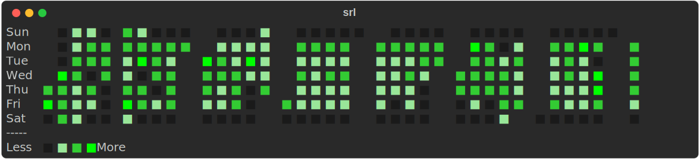

# `srl` — Spaced Repetition Learning CLI



A lightweight command-line tool for mastering LeetCode-style data structures and algorithm problems using **spaced repetition**.

## Overview

This tool helps you practice LeetCode problems more effectively using spaced repetition. When you attempt a problem, rate yourself from `1-5`:

| Rating | Meaning                            | Next Attempt |
| ------ | ---------------------------------- | ------------ |
| 1      | Couldn’t solve / needed a solution | 1 day        |
| 2      | Solved with significant struggle   | 2 days       |
| 3      | Solved with minor struggle         | 3 days       |
| 4      | Solved smoothly with few gaps      | 4 days       |
| 5      | Solved perfectly, confidently      | 5 days       |

If you rate a problem `5` two times in a row, it’s considered mastered and moved to the **mastered list**.

## Data Storage

Data is stored in the `~/.srl` directory, which is created automatically.

## Installation

### Homebrew

```bash
brew tap HayesBarber/tap
brew install srl
```

### From Source
**Prerequisites**: Python 3.10+ is required.

1. Clone the repo:

```bash
git clone https://github.com/HayesBarber/spaced-repetition-learning.git
cd spaced-repetition-learning
```

2. Install the package:

Install with [uv](https://docs.astral.sh/uv/):

```bash
uv pip install -e .
```

Create a venv or use `--system` for system wide installation

## Recommended Workflow

1. Queue up problems

   ```bash
   srl nextup add -f starter_data/neetcode_150.txt
   ```
2. View today’s work

   ```bash
   srl list
   ```
3. Work on problems and log the attempts with a rating

   ```bash
   srl add <problem> <rating>
   ```
4. Rinse and repeat daily

## Usage

### Add or Update a Problem Attempt

```bash
srl add "Two Sum" 3
```

- Adds a new attempt or updates an existing one.
- Rating must be between `1` and `5`.

To include a URL to the problem:

```bash
srl add "Two Sum" 3 -u "https://leetcode.com/problems/two-sum/"
```

You can also add an attempt by its number in the `srl list` output. This is useful to avoid retyping long problem names.

```bash
# Assuming "Two Sum" is number 1 in `srl list`
srl add -n 1 3
```

---

### Remove a Problem

You can remove a problem either by **name** or by its **number** from `srl inprogress`.

```bash
srl remove "Two Sum"
```

```bash
srl remove -n 3
```

- Removes a problem from your in-progress list.

---

### List Problems Due Today

```bash
srl list
```

Lists all problems scheduled for today as a numbered list, sorted by:

1. Earliest last attempt.
2. Lower ratings first.

Problems whose most recent rating was 5 are marked with a asterisk (*) to indicate a _mastery attempt_.

You can limit the number of problems shown:

```bash
srl list -n 3
```

To include URLs as clickable links, use the `-u` flag:

```bash
srl list -u
```

This will display problems with their stored URLs as "[Open in Browser]" links when available. If no problems are due today, it will fall back to showing problems from the Next Up queue with URLs if they exist.

---

### View In-Progress Problems

```bash
srl inprogress
```

Shows all problems that are currently in progress (not yet mastered) as a numbered list.

To include URLs as clickable links, use the `-u` flag:

```bash
srl inprogress -u
```

This will display problems with their stored URLs as "[Open in Browser]" links when available.

---

### View Mastered Problems

```bash
srl mastered
```

Shows all problems you’ve marked as mastered (achieved `5` twice in a row).

You can show the count of mastered problems by passing in the `-c` or `--count` flag.

```bash
srl mastered -c
```

---

### View All Attempts

```bash
srl ledger
```

Displays a table of all your attempts across in-progress, mastered, and audit categories, sorted by date.

You can show the count of attempts by passing in the `-c` or `--count` flag.

```bash
srl ledger -c
```

---

### Manage the Next Up Queue

Add problems to your Next Up queue — problems you'd like to tackle next when nothing is due.

By default, `srl nextup add` **will skip problems that are already in the queue, in progress, or mastered** to avoid duplicates. You will see a message explaining why a problem was skipped.

```bash
srl nextup add "Sliding Window Maximum"
```

You can also include a URL when adding a problem:

```bash
srl nextup add "Sliding Window Maximum" -u "https://leetcode.com/problems/sliding-window-maximum/"
```

If you want to add a problem that is already mastered, use the `--allow-mastered` flag:

```bash
srl nextup add "Sliding Window Maximum" --allow-mastered
```

You can also add multiple problems at once from a file (one problem per line) using the `-f` or `--file` flag. The same deduplication rules apply:

```bash
srl nextup add -f starter_data/blind_75.txt
```

Starter data files are available in the `starter_data/` directory at the top level of the repo. For example:

***These files currently only contain links and will add the problems with the link as the problem name rather than utilizing the `-u` flag***

- [starter_data/blind_75.txt](starter_data/blind_75.txt)
- [starter_data/neetcode_150.txt](starter_data/neetcode_150.txt)

List problems in the queue:

```bash
srl nextup list
```

To include URLs as clickable links when listing, use the `-u` flag:

```bash
srl nextup list -u
```

This will display problems with their stored URLs as "[Open in Browser]" links when available.

Remove a problem from the queue:

```bash
srl nextup remove "Sliding Window Maximum"
```

Clear the queue:

```bash
srl nextup clear
```

---

### Random Audit

When running `srl list` there is a 10% chance you will be "audited" with a problem from your mastered list.

You can also manually trigger an audit:

```bash
srl audit
```

If you passed the audit:

```bash
srl audit pass
```

If you failed the audit:

```bash
srl audit fail
```

View your complete audit history with statistics:

```bash
srl audit history
```

This displays a list of your audit attempts along with summary statistics including total audits, pass count, fail count, and pass rate percentage.

---

### Random command

A convenient helper was added to pick a single problem at random from your data.

- srl random

  Picks a random problem from the set of problems that are due today (same logic as `srl list`). If there are no problems due, this falls back to the `Next Up` queue.

  ```bash
  srl random
  ```

  Use this when you want a quick, random practice item from today's due list.

- srl random --all

  Picks a random problem from every problem you have stored: in-progress problems, mastered problems, and items in the Next Up queue. This is useful when you want a completely random review across your whole dataset.

  ```bash
  srl random --all
  ```

  If no problems exist in your data directory, the command prints a friendly message.

---

### Update Configuration

You can set configuration values such as the audit probability (default is 0.1):

```bash
srl config --audit-probability 0.2
```

This updates the probability that a random audit occurs when running `srl list`.

To view the current config:

```bash
srl config --get
```

---

### Take Command

The `take` command streamlines adding problems and can be easily piped into other commands.

- Print the problem at a specific index in your due list:

```bash
srl take <index>
```

This prints the problem at the given index (as shown in `srl list`), making it easy to copy or pipe elsewhere.

- Print the URL at a specific index:

```bash
srl take <index> -u
```

This prints the URL stored for the problem at that index, or nothing if no URL exists.

- Add a problem at a given index with a rating:

```bash
srl take <index> add <rating>
```

This adds the problem at that index with your given rating (1-5), just like `srl add`. It's a shortcut to avoid retyping problem names.

---

### Calendar Command

The `calendar` command displays a contribution-style heatmap of your problem-solving activity over the past year.

```bash
srl calendar
```

This shows counts of your attempts per day with colors representing the intensity of activity. It helps you visualize your consistency and progress in practicing problems over time.

You can also control how many months to display using the `--months` or `-m` flag (default is 12):

```bash
srl calendar --months 6
```

or using the shorthand:

```bash
srl calendar -m 3
```

You can customize the colors used by `srl calendar`. Colors are configured by intensity level, where level 0 is the lowest activity and higher numbers represent stronger activity.

Set one or more levels with:
```bash
srl config --set-color 0=#1a1a1a --set-color 1=#99e699
```

To reset the heatmap colors back to the defaults:
```bash
srl config --reset-colors
```

---

### Server Command

Run an HTTP server that exposes the srl CLI via a simple JSON API.

Usage:

```bash
srl server [--host HOST] [--port PORT] [--reload] [--public]
```

Options:

- --host: Host to bind to (default: 127.0.0.1)
- --port: Port to listen on (default: 8080)
- --reload: Enable auto-reload for development
- --public: Alias to bind to 0.0.0.0

Examples:

- Start a local server on the default port:

  ```bash
  srl server
  ```

- Bind publicly on port 80:
  ```bash
  srl server --public --port 80
  ```

What it exposes:

- POST /run — Execute CLI commands. Send JSON with either:
  - { "cmd": "add \"Two Sum\" 3" } (single string command)
  - { "argv": ["add", "Two Sum", "3"] } (argv-style array)

Responses include "output" on success (captured console text) or "error" / help text on failure or invalid input.

A Dockerfile is included for convenience. Build and run the server with:

```bash
# build an image named "srl"
docker build -t srl .

# run locally, exposing the server on port 8080 and mounting your data dir
docker run --rm -p 8080:8080 -v "$HOME/.srl:/root/.srl" srl
```

---

## Contributing

See [CONTRIBUTING.md](CONTRIBUTING.md) for development setup and testing instructions.
