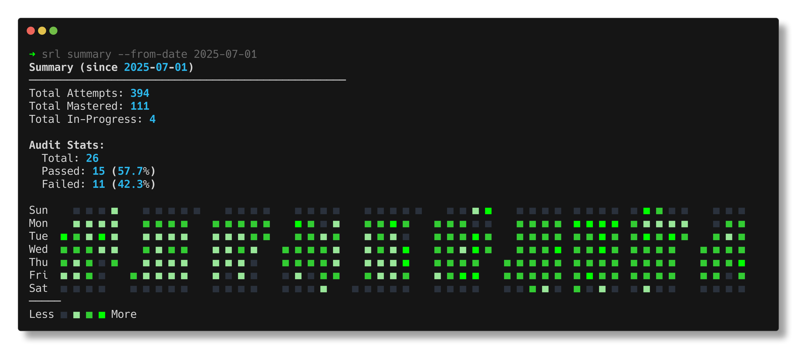

# `srl` — Spaced Repetition Learning CLI



A lightweight command-line tool for mastering LeetCode-style data structures and algorithm problems using **spaced repetition**.

## Overview

This tool helps you practice LeetCode problems more effectively using spaced repetition. When you attempt a problem, rate yourself from `1-5`:

| Rating | Meaning                            | Next Attempt |
| ------ | ---------------------------------- | ------------ |
| 1      | Couldn’t solve / needed a solution | 1 day        |
| 2      | Solved with significant struggle   | 2 days       |
| 3      | Solved with minor struggle         | 3 days       |
| 4      | Solved smoothly with few gaps      | 4 days       |
| 5      | Solved perfectly, confidently      | 5 days       |

If you rate a problem `5` two times in a row, it’s considered mastered and moved to the **mastered list**.

## Data Storage

Data is stored in the `~/.srl` directory, which is created automatically.

## Installation

### Homebrew

```bash
brew tap HayesBarber/tap
brew install srl
```

### From Source
**Prerequisites**: Python 3.10+ is required.

1. Clone the repo:

```bash
git clone https://github.com/HayesBarber/spaced-repetition-learning.git
cd spaced-repetition-learning
```

2. Install the package:

Install with [uv](https://docs.astral.sh/uv/):

```bash
uv pip install -e .
```

Create a venv or use `--system` for system wide installation

## Recommended Workflow

1. Queue up problems

   ```bash
   srl nextup add -f starter_data/neetcode_150.csv
   ```
2. View today’s work

   ```bash
   srl list
   ```
3. Work on problems in order and log the attempts with a rating

   ```bash
   srl add <rating>
   ```

   > by default this rates the first problem from `srl list`
4. Rinse and repeat daily

## Usage

### Add or Update a Problem Attempt

- Adds a new attempt or updates an existing one.
- Rating must be between `1` and `5`.
- Uses the first problem from `srl list` by default

```bash
srl add 3
```

You can specify a problem name / url. This is generally used for one-off, net-new problems.

```bash
srl add 3 -p "Two Sum" -u "https://leetcode.com/problems/two-sum/"
```

You can also add an attempt by its number in the `srl list` output if you attempted a problem out of order.

```bash
# Assuming "Two Sum" is number 2 in `srl list`
srl add 3 -n 2
```

If you make a typo in the rating, use `--amend` to replace the last attempt instead of adding a new one. The original date is preserved.

```bash
srl add 1                       # Oops, meant 5
srl add 5 -p "Two Sum" --amend  # Replaces the previous rating, keeps the date
```

---

### Remove a Problem

You can remove a problem either by **name** or by its **number** from `srl inprogress`.

```bash
srl remove "Two Sum"
```

```bash
srl remove -n 3
```

- Removes a problem from your in-progress list.

---

### List Problems Due Today

```bash
srl list
```

Lists all problems scheduled for today as a numbered list, sorted by:

1. Earliest last attempt.
2. Lower ratings first.

Problems whose most recent rating was 5 are marked with a asterisk (*) to indicate a _mastery attempt_.

You can limit the number of problems shown:

```bash
srl list -n 3
```

To include URLs as clickable links, use the `-u` flag:

```bash
srl list -u
```

This will display problems with their stored URLs as "[Open in Browser]" links when available.

If no problems are due today, it will fall back to showing problems from the Next Up queue with URLs if they exist.

---

### View In-Progress Problems

```bash
srl inprogress
```

Shows all problems that are currently in progress (not yet mastered) as a numbered list.

To include URLs as clickable links, use the `-u` flag:

```bash
srl inprogress -u
```

This will display problems with their stored URLs as "[Open in Browser]" links when available.

---

### View Mastered Problems

```bash
srl mastered
```

Shows all problems you’ve marked as mastered (achieved `5` twice in a row).

You can show the count of mastered problems by passing in the `-c` or `--count` flag.

```bash
srl mastered -c
```

---

### View All Attempts

```bash
srl ledger
```

Displays a table of all your attempts across in-progress, mastered, and audit categories, sorted by date.

You can filter to a specific problem by name or by number from `srl list`:

```bash
srl ledger "Two Sum"
srl ledger -n 1
```

This renders a focused view showing all attempts for that problem, sorted most recent first, with the title `Two Sum (3)` indicating the total attempt count.

You can show the count of attempts by passing in the `-c` or `--count` flag.

```bash
srl ledger -c
```

---

### Manage the Next Up Queue

Add problems to your Next Up queue — problems you'd like to tackle next when nothing is due.

By default, `srl nextup add` **will skip problems that are already in the queue, in progress, or mastered** to avoid duplicates. You will see a message explaining why a problem was skipped.

```bash
srl nextup add "Sliding Window Maximum"
```

You can also include a URL when adding a problem:

```bash
srl nextup add "Sliding Window Maximum" -u "https://leetcode.com/problems/sliding-window-maximum/"
```

If you want to add a problem that is already mastered, use the `--allow-mastered` flag:

```bash
srl nextup add "Sliding Window Maximum" --allow-mastered
```

You can also add multiple problems at once from a file using the `-f` or `--file` flag. Files should be in CSV format with `name,url` per line. The same deduplication rules apply:

```bash
srl nextup add -f starter_data/blind_75.csv
```

Example CSV format:
```csv
Two Sum,https://leetcode.com/problems/two-sum/description/
Valid Parentheses,https://leetcode.com/problems/valid-parentheses/description/
```

Starter data files are available in the `starter_data/` directory:

- [starter_data/blind_75.csv](starter_data/blind_75.csv)
- [starter_data/neetcode_150.csv](starter_data/neetcode_150.csv)

List problems in the queue:

```bash
srl nextup list
```

To include URLs as clickable links when listing, use the `-u` flag:

```bash
srl nextup list -u
```

This will display problems with their stored URLs as "[Open in Browser]" links when available.

Remove a problem from the queue:

```bash
srl nextup remove "Sliding Window Maximum"
```

Remove a problem by number:

```bash
srl nextup remove -n 1
```

Clear the queue:

```bash
srl nextup clear
```

---

### Random Audit

When running `srl list` there is a 10% chance you will be "audited" with a problem from your mastered list.

You can also manually trigger an audit:

```bash
srl audit
```

If you passed the audit:

```bash
srl audit pass
```

If you failed the audit:

```bash
srl audit fail
```

View your complete audit history with statistics:

```bash
srl audit history
```

This displays a list of your audit attempts along with summary statistics including total audits, pass count, fail count, and pass rate percentage.

---

### Update Configuration

You can set configuration values such as the audit probability (default is 0.1):

```bash
srl config --audit-probability 0.2
```

This updates the probability that a random audit occurs when running `srl list`.

You can also configure the maximum number of days without an audit (default is 7). If this many days pass without an audit, one will be forced regardless of probability:

```bash
srl config --max-days-without-audit 5
```

Set to 0 to disable the max days check and rely solely on probability:

```bash
srl config --max-days-without-audit 0
```

Configure the maximum number of backups to retain for `srl backup` (default is 10):

```bash
srl config --max-backups 5
```

Configure backup replication:

```bash
srl config --replication-remote-host 192.168.1.100
srl config --replication-remote-port 3000
srl config --replication-enabled
```

To view the current config:

```bash
srl config --get
```

---

### Take Command

The `take` command streamlines adding problems and can be easily piped into other commands.

- Print the problem at a specific index in your due list:

```bash
srl take <index>
```

This prints the problem at the given index (as shown in `srl list`), making it easy to copy or pipe elsewhere.

- Print the URL at a specific index:

```bash
srl take <index> -u
```

This prints the URL stored for the problem at that index, or `None` if no URL exists.

- Add a problem at a given index with a rating:

```bash
srl take <index> add <rating>
```

This adds the problem at that index with your given rating (1-5), just like `srl add`. It's a shortcut to avoid retyping problem names.

---

### Calendar Command

The `calendar` command displays a contribution-style heatmap of your problem-solving activity over the past year.

```bash
srl calendar
```

This shows counts of your attempts per day with colors representing the intensity of activity. It helps you visualize your consistency and progress in practicing problems over time.

You can also control how many months to display using the `--months` or `-m` flag (default is 12):

```bash
srl calendar --months 6
```

or using the shorthand:

```bash
srl calendar -m 3
```

or from the first recorded SRL entry:

```bash
srl calendar --from-first
```

You can customize the colors used by `srl calendar`. Colors are configured by intensity level, where level 0 is the lowest activity and higher numbers represent stronger activity.

Set one or more levels with:
```bash
srl config --set-color 0=#1a1a1a --set-color 1=#99e699
```

To reset the heatmap colors back to the defaults:
```bash
srl config --reset-colors
```

---

### Summary Command

The `summary` command displays a consolidated view of all your SRL statistics:

```bash
srl summary
```

This prints:
- Total attempts across all problems
- Total mastered problems count
- Total in-progress problems count
- Audit statistics (total, passed, failed, pass rate)
- Calendar heatmap from your first recorded entry

You can filter all statistics to show only activity since a specific date:

```bash
srl summary --from-date 2026-01-01
```

---

### Server Command

Run an HTTP server that exposes the srl CLI via a simple JSON API.

Usage:

```bash
srl server [--host HOST] [--port PORT]
```

Options:

- --host: Host to bind to (default: 127.0.0.1)
- --port: Port to listen on (default: 8080)

Examples:

- Start a local server on the default port:

  ```bash
  srl server
  ```

- Start on a custom port:

  ```bash
  srl server --port 3000
  ```

- Bind to all interfaces:

  ```bash
  srl server --host 0.0.0.0
  ```

#### HTTP API

Send POST requests to the server with JSON body containing an `argv` array:

```bash
curl -X POST http://127.0.0.1:8080 \
  -H "Content-Type: application/json" \
  -d '{"argv": ["list"]}'
```

Response format:

```json
{
  "status": "success",
  "output": "...",
  "error": null
}
```

On error:

```json
{
  "status": "error",
  "output": "",
  "error": "error message"
}
```

The `argv` array should contain the command and its arguments. For example:

- `{"argv": ["list"]}` — runs `srl list`
- `{"argv": ["add", "Two Sum", "4"]}` — runs `srl add "Two Sum" 4`
- `{"argv": ["ledger", "-c"]}` — runs `srl ledger -c`

Note: The `server` command itself is not available via the HTTP API.

#### Backup Replication Endpoint

The server exposes a `/backup` endpoint for receiving replicated backups:

- **Method**: POST
- **Content-Type**: `application/gzip`
- **Body**: Raw gzip backup archive data

When a backup is replicated from another SRL instance, it is saved to the local backup directory and verified automatically.

---

### Backup Command

Create a backup archive of all your SRL storage data:

```bash
srl backup
```

This creates a `tar.gz` archive in `~/.srl/backups/` with:
- All storage files (`problems_in_progress.json`, `problems_mastered.json`, `next_up.json`, `audit.json`, `config.json`)
- A `manifest.json` containing schema version, creation timestamp, and list of included files

Filename format: `backup-YYYY-MM-DDTHHMMSS.tar.gz`

If multiple backups are created within the same second, a counter suffix is added: `backup-2026-04-26T120000-1.tar.gz`

#### List Backups

```bash
srl backup list
```

Displays all available backups with their creation timestamp and size.

#### Verify a Backup

```bash
srl backup verify <archive>
```

Verifies that a backup archive is valid (can be opened, has a valid manifest, and all referenced files are present in the archive).

#### Restore from Backup

```bash
srl backup restore <archive>
```

Restores SRL state from a backup archive. You will be prompted to confirm the overwrite and asked whether to create a backup of the current state first.

To skip all prompts and automatically create a pre-restore backup:

```bash
srl backup restore <archive> -y
```

#### Backup Replication

Automatically replicate backups to a remote SRL server for offsite storage.

Configure replication:

```bash
# Set remote server host
srl config --replication-remote-host 192.168.1.100

# Set remote server port (default: 8080)
srl config --replication-remote-port 3000

# Enable replication
srl config --replication-enabled

# Disable replication
srl config --replication-disabled
```

When replication is enabled, running `srl backup` will automatically send the backup to the configured remote server's `/backup` endpoint. The remote server must be running `srl server` to accept replicated backups.

---

## Contributing

See [CONTRIBUTING.md](CONTRIBUTING.md) for development setup and testing instructions.
